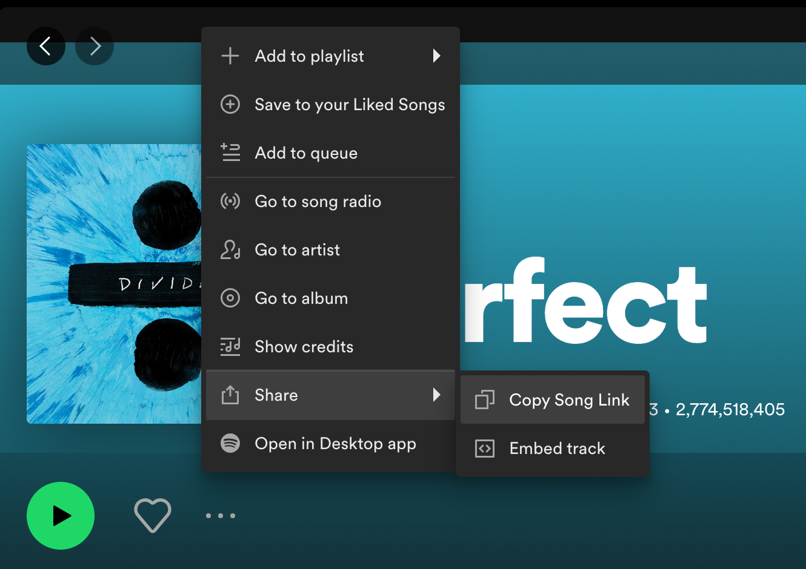
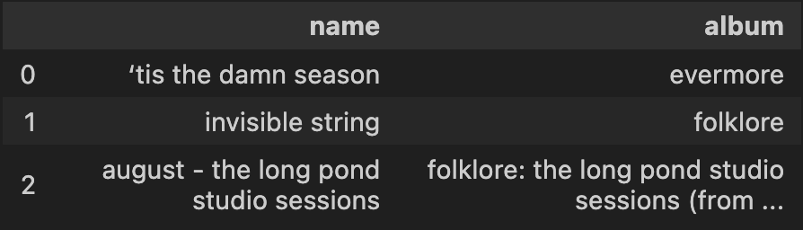

# Taylor Swift Song Recommender
 Use your favourite song to find your perfect Taylor Swift song! \
 Completed 2024 \
 By Clara Hong (clarashong)

 ## Introduction
With Taylor Swift's current accomplishment in becoming the top streamed artist on spotify as well as the quick-to-sell-out nature of the Eras Tour, I found myself diving into her discography and wanting to become a bigger Swiftie. 

 ## Description 
This project was made in Jupyter Notebook with python and pandas, and is a way for any music listener, to find some Taylor Swift tracks that match their taste. The program uses data from the following Kaggle datasets: [Spotify Tracks Data Set](https://www.kaggle.com/datasets/maharshipandya/-spotify-tracks-dataset), 
[Taylor Swift Spotify Dataset](https://www.kaggle.com/datasets/jarredpriester/taylor-swift-spotify-dataset/data?select=taylor_swift_spotify.csv)

Through this program, I wanted to practice pandas skills, and create something fun out of these two datasets. Since song attributes like "danceability" and "energy" where already listed out, I thought it was the perfect opportunity to make a recommendation program. 

## Usage 

For the project, you need Jupyter Notebook which can be installed through running: 
```sh
pip install notebook
```
Launch the notebook: ``` main.ipynb ```

### Inputting your song: 
This program uses spotify data to find tracks. To get the song you want to use, go to spotify, find the track's options then go:  ```share``` >> ``` Copy Song Link```

 

You can put the song link in the section of the notebook: ```Find Spotify Track Data``` >>> 
```Link and Number of Recommendations```. In this same section, you can choose how many recommendations you want. 

**Disclaimer**: The program only works if the inputted song is within the dataset. 

### Finding Results: 

Once the information is filled in, run all the boxes in consecutive order. The final recommendations can be found at the end under the last box, in the section ```Final Results```. 

Results will look like: 
 

## Examples 
### Example 1: august - Taylor Swift 
Spotify link: 
(https://open.spotify.com/track/3hUxzQpSfdDqwM3ZTFQY0K?si=0a4b2162f6f54e95) 

Number of recommendations: 3

**Taylor Swift Song Recommendations:**
- "'tis the damn season" 
- "invisible string" 
- "august - the long pond studio sessions" 

### Example 2: Hey, Soul Sister - Train 
Spotify link:
(https://open.spotify.com/track/4HlFJV71xXKIGcU3kRyttv?si=3040bb8380ae4bc4)

Number of recommendations: 1

**Taylor Swift Song Recommendations:**
- "Mr. Perfectly Fine (Taylor's Version) (From the Vault)"

## Contributions
Not accepting contributions